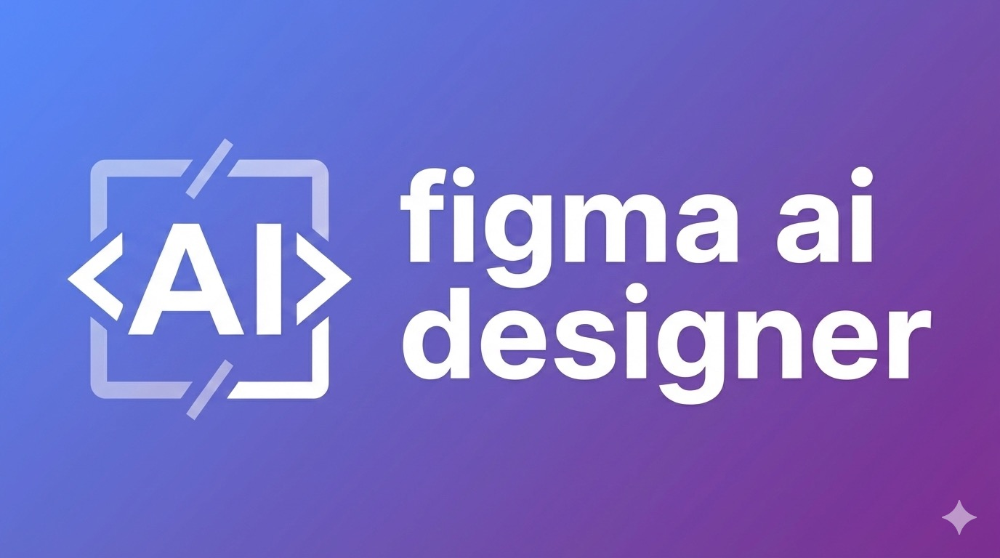

# Figma AI Designer



> Transform AI-generated HTML/CSS into native Figma components instantly.

[](https://www.npmjs.com/package/figma-ai-designer)
[](https://opensource.org/licenses/MIT)

---

## Quick Start (Claude Code)

**1. Add MCP server** - Create `.mcp.json` in your project:

```json
{
  "mcpServers": {
    "figma-ai-designer": {
      "command": "npx",
      "args": ["figma-ai-designer"]
    }
  }
}
```

**2. Install Figma plugin** - [Get from Figma Community](https://www.figma.com/community/plugin/1592573139477373341) or import `manifest.json` for development

**3. Open the plugin in Figma** - Wait for "Connected" status

**4. Ask Claude to create designs:**

```
"Create a pricing card with title, price, feature list, and CTA button"
```

That's it! The component appears in your Figma canvas.

---

## Other AI Clients

<details>
<summary><strong>Claude Desktop</strong></summary>

Edit `~/Library/Application Support/Claude/claude_desktop_config.json` (macOS) or `%APPDATA%\Claude\claude_desktop_config.json` (Windows):

```json
{
  "mcpServers": {
    "figma-ai-designer": {
      "command": "npx",
      "args": ["figma-ai-designer"]
    }
  }
}
```

</details>

<details>
<summary><strong>Cursor / VS Code</strong></summary>

Add to your MCP settings:

```json
{
  "figma-ai-designer": {
    "command": "npx",
    "args": ["figma-ai-designer"]
  }
}
```

</details>

---

## Example Prompts

| Prompt | Result |
|--------|--------|
| "Create a button with blue gradient background" | Styled button component |
| "Design a user profile card with avatar, name, and bio" | Profile card with Auto Layout |
| "Build a navigation bar with logo and menu items" | Horizontal nav component |
| "Make a mobile app screen for a coffee ordering app" | Full mobile UI screen |
| "Create a dashboard widget showing statistics" | Data visualization card |

---

## How It Works

```
You: "Create a login form"
         ↓
   Claude (generates HTML/CSS)
         ↓
   MCP Server (parses & converts)
         ↓
   Figma Plugin (WebSocket)
         ↓
   Figma Canvas ✨
```

---

## Features

- **Natural Language to Figma** - Describe what you want, get a Figma component
- **Proper Auto Layout** - Flexbox converts to Figma's native Auto Layout
- **Full Styling Support** - Colors, gradients, typography, borders, shadows
- **Real-time Connection** - WebSocket ensures instant updates
- **Works with Any MCP Client** - Claude Code, Claude Desktop, Cursor, and more

---

## Supported HTML & CSS

### HTML Elements

| HTML | Figma Node |
|------|------------|
| `<div>`, `<section>`, `<article>`, `<header>`, `<footer>`, `<nav>` | Frame |
| `<span>`, `<p>`, `<h1>`-`<h6>`, `<label>` | Text |
| `<button>` | Frame with Text (styled) |
| `<input>`, `<textarea>` | Frame with Text (input style) |
| `` | Rectangle with placeholder |

### CSS Properties

- **Layout**: `display: flex`, `flex-direction`, `justify-content`, `align-items`, `gap`
- **Sizing**: `width`, `height`, `min-*`, `max-*`
- **Spacing**: `padding`, `margin`
- **Background**: `background-color`, `linear-gradient()`
- **Border**: `border-radius`, `border-width`, `border-color`
- **Typography**: `font-size`, `font-weight`, `color`, `text-align`, `line-height`
- **Effects**: `opacity`, `box-shadow`

---

## MCP Tools

| Tool | Description |
|------|-------------|
| `create_component_from_html` | Create Figma component from HTML/CSS |
| `get_current_selection` | Get info about selected nodes |
| `list_components` | List all components on current page |
| `get_plugin_status` | Check plugin connection status |

---

## Development

```bash
git clone https://github.com/KosukeOnishi/figma-ai-designer.git
cd figma-ai-designer
npm install
npm run build:all
```

| Command | Description |
|---------|-------------|
| `npm run build` | Build MCP server |
| `npm run build:plugin` | Build Figma plugin |
| `npm run build:all` | Build both |

---

## Troubleshooting

**Plugin shows "Disconnected"**
- Make sure MCP server is running (restart your AI client)
- Click "Reconnect" in the plugin

**Component not appearing**
- Check for "Connected" status in plugin
- Ensure a Figma file is open (not just home screen)

---

## License

MIT - [Kosuke Onishi](https://github.com/KosukeOnishi)

Built with [MCP](https://modelcontextprotocol.io/) and [Figma Plugin API](https://www.figma.com/plugin-docs/)
